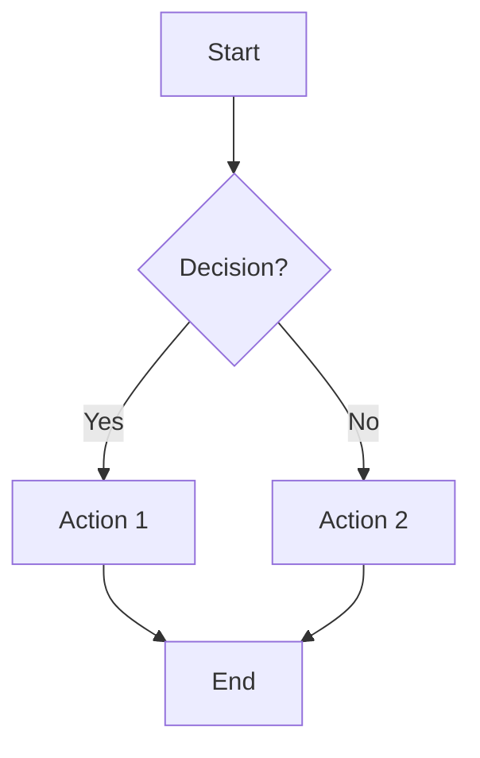

# Visual Documentation Quick Start

This guide helps you quickly navigate the visual documentation for the Golang home automation system.

## 🎯 Quick Links

| I want to... | Go to... |
|--------------|----------|
| **Understand the overall system** | [System Architecture](#system-architecture) in VISUAL_ARCHITECTURE.md |
| **See how plugins interact** | [Plugin Architecture](#plugin-system-architecture) in VISUAL_ARCHITECTURE.md |
| **Understand music selection logic** | [Music Manager Flow](#music-manager-logic-flow) in VISUAL_ARCHITECTURE.md |
| **Understand lighting control** | [Lighting Control Flow](#lighting-control-logic-flow) in VISUAL_ARCHITECTURE.md |
| **See state variable dependencies** | [State Dependency Graph](#state-variable-dependency-graph) in VISUAL_ARCHITECTURE.md |
| **Learn about diagram automation** | [Diagram Generation Rules](./architecture/DIAGRAM_GENERATION_RULES.md) |

## 📚 Main Documentation Files

### [VISUAL_ARCHITECTURE.md](./architecture/VISUAL_ARCHITECTURE.md)
**Purpose:** Visual representation of the Go implementation using Mermaid diagrams

**Contents:**
1. **System Architecture** - High-level component view
2. **Plugin System Architecture** - How plugins interact with state management
3. **State Synchronization Flow** - How state changes propagate
4. **Music Manager Logic Flow** - Decision tree for music mode selection
5. **Lighting Control Logic Flow** - Scene activation logic
6. **Energy State Logic Flow** - Battery level calculation
7. **State Variable Dependency Graph** - Who reads/writes what

**When to use:**
- New developer onboarding
- Understanding a specific plugin's logic
- Debugging state flow issues
- Comparing Go implementation to Node-RED flows

### [DIAGRAM_GENERATION_RULES.md](./architecture/DIAGRAM_GENERATION_RULES.md)
**Purpose:** Strategy for automated diagram generation from code

**Contents:**
- Code annotation approach
- AST-based generation
- Runtime instrumentation
- Maintenance strategy

**When to use:**
- Planning to automate diagram updates
- Need to ensure diagrams stay synchronized with code
- Want to generate dependency matrices automatically

## 🔍 How to View Diagrams

### GitHub (Easiest)
1. Navigate to any `.md` file with Mermaid diagrams
2. GitHub automatically renders Mermaid diagrams in markdown preview
3. Click on the file to view

### VS Code
1. Install extension: "Markdown Preview Mermaid Support"
2. Open any `.md` file with diagrams
3. Press `Cmd+Shift+V` (Mac) or `Ctrl+Shift+V` (Windows/Linux)
4. Diagrams render inline

### Mermaid Live Editor
1. Copy any `mermaid` code block
2. Go to https://mermaid.live/
3. Paste and edit interactively
4. Export as PNG/SVG if needed

## 🎨 Diagram Types Available

### 1. Architecture Diagrams
- **System Architecture**: Shows all components and their relationships
- **Plugin Architecture**: Shows how plugins interact with core layers

**Use cases:**
- Understanding overall system design
- Onboarding new developers
- Planning architectural changes

### 2. Flow Diagrams
- **Music Manager Logic**: Decision tree for mode selection
- **Lighting Control Logic**: Scene activation rules
- **Energy State Logic**: Battery level calculation

**Use cases:**
- Understanding business logic
- Comparing with Node-RED implementation
- Debugging unexpected behavior

### 3. Data Flow Diagrams
- **State Synchronization Flow**: How state changes propagate
- **Plugin System Sequence**: Message flow between components

**Use cases:**
- Understanding data flow
- Debugging state synchronization issues
- Performance optimization

### 4. Dependency Graphs
- **State Variable Dependency**: Who reads/writes which variables

**Use cases:**
- Understanding variable usage
- Impact analysis for changes
- Finding unused variables

## 📝 Comparing Go Implementation to Node-RED

| Node-RED Flow | Go Implementation | Visual Diagram |
|---------------|-------------------|----------------|
| **Music** | `internal/plugins/music/manager.go` | [Music Manager Logic Flow](./architecture/VISUAL_ARCHITECTURE.md#music-manager-logic-flow) |
| **Lighting Control** | `internal/plugins/lighting/manager.go` | [Lighting Control Logic Flow](./architecture/VISUAL_ARCHITECTURE.md#lighting-control-logic-flow) |
| **Energy State** | `internal/plugins/energy/manager.go` | [Energy State Logic Flow](./architecture/VISUAL_ARCHITECTURE.md#energy-state-logic-flow) |
| **State Tracking** | `internal/plugins/statetracking/manager.go` | [State Dependency Graph](./architecture/VISUAL_ARCHITECTURE.md#state-variable-dependency-graph) |
| **Sleep Hygiene** | `internal/plugins/sleephygiene/manager.go` | [State Synchronization Flow](./architecture/VISUAL_ARCHITECTURE.md#state-synchronization-flow) |
| **TV Monitoring** | `internal/plugins/tv/manager.go` | [State Dependency Graph](./architecture/VISUAL_ARCHITECTURE.md#state-variable-dependency-graph) |
| **Security** | `internal/plugins/security/manager.go` | [State Dependency Graph](./architecture/VISUAL_ARCHITECTURE.md#state-variable-dependency-graph) |
| **Load Shedding** | `internal/plugins/loadshedding/manager.go` | [State Dependency Graph](./architecture/VISUAL_ARCHITECTURE.md#state-variable-dependency-graph) |

## 🛠️ Maintaining Diagrams

### When to Update

Update diagrams when:
- ✅ New plugin is added
- ✅ Plugin dependencies change (new `Subscribe()` calls)
- ✅ State variables are added/removed
- ✅ Business logic changes significantly
- ✅ Architecture changes

### How to Update

1. **Find the relevant diagram** in [VISUAL_ARCHITECTURE.md](./architecture/VISUAL_ARCHITECTURE.md)
2. **Edit the Mermaid code** directly in markdown
3. **Preview** in VS Code or Mermaid Live Editor
4. **Verify** rendering in GitHub
5. **Update "Last Updated"** timestamp
6. **Include in PR** with code changes

### Tips for Editing Mermaid

**Syntax Guide:**
- `graph TD` = Top-Down flowchart
- `graph LR` = Left-Right flowchart
- `sequenceDiagram` = Sequence diagram
- `-->` = Arrow
- `-.->` = Dotted arrow
- `{}` = Decision (diamond)
- `[]` = Rectangle
- `()` = Rounded rectangle

**Full syntax:** https://mermaid.js.org/syntax/flowchart.html

## 🚀 Next Steps

### For Developers
1. ✅ Read [VISUAL_ARCHITECTURE.md](./architecture/VISUAL_ARCHITECTURE.md) to understand the system
2. ✅ Use diagrams to understand plugin logic before making changes
3. ✅ Update diagrams when changing code
4. ✅ Reference diagrams in PR descriptions

### For Automation (Future)
1. ⏳ Implement AST-based dependency extraction
2. ⏳ Generate variable usage matrix automatically
3. ⏳ Add CI/CD checks for diagram freshness

See [DIAGRAM_GENERATION_RULES.md](./architecture/DIAGRAM_GENERATION_RULES.md) for automation strategy.

---

**Quick Reference Card:**

| Task | Command/Link |
|------|--------------|
| View all diagrams | Open [VISUAL_ARCHITECTURE.md](./architecture/VISUAL_ARCHITECTURE.md) |
| Edit diagram | Edit Mermaid code block in markdown |
| Preview diagram | Use VS Code with Mermaid extension |
| Test diagram | Paste into https://mermaid.live/ |
| Learn Mermaid syntax | https://mermaid.js.org/ |

---

**Last Updated:** 2025-11-16
**Maintained By:** Development Team
