# Visual Architecture Guide

This document provides Mermaid diagrams to visualize the Golang home automation system architecture and logic flows.

## Table of Contents
- [System Architecture](#system-architecture)
- [Plugin System Architecture](#plugin-system-architecture)
- [State Synchronization Flow](#state-synchronization-flow)
- [Shadow State System](#shadow-state-system)
- [API Server Endpoints](#api-server-endpoints)
- [Reset Coordinator Flow](#reset-coordinator-flow)
- [Music Manager Logic Flow](#music-manager-logic-flow)
- [Lighting Control Logic Flow](#lighting-control-logic-flow)
- [Energy State Logic Flow](#energy-state-logic-flow)
- [State Variable Dependency Graph](#state-variable-dependency-graph)

---

## System Architecture

High-level view of the system components and their interactions.

```mermaid
graph TB
    subgraph "Home Automation Go Application"
        Main[cmd/main.go]

        subgraph "Core Layer"
            HAClient[HA WebSocket Client<br/>internal/ha/client.go]
            StateManager[State Manager<br/>internal/state/manager.go]
            Variables[State Variables<br/>internal/state/variables.go]
            Computed[Computed State<br/>internal/state/computed.go]
        end

        subgraph "Observability Layer"
            ShadowTracker[Shadow State Tracker<br/>internal/shadowstate/tracker.go]
            APIServer[HTTP API Server<br/>internal/api/server.go]
        end

        subgraph "Plugin Layer"
            StateTracking[State Tracking<br/>internal/plugins/statetracking/]
            DayPhase[Day Phase<br/>internal/plugins/dayphase/]
            Music[Music Manager<br/>internal/plugins/music/]
            Lighting[Lighting Manager<br/>internal/plugins/lighting/]
            Energy[Energy Manager<br/>internal/plugins/energy/]
            TV[TV Manager<br/>internal/plugins/tv/]
            Sleep[Sleep Hygiene<br/>internal/plugins/sleephygiene/]
            Security[Security Manager<br/>internal/plugins/security/]
            LoadShed[Load Shedding<br/>internal/plugins/loadshedding/]
            ResetCoord[Reset Coordinator<br/>internal/plugins/reset/]
        end

        subgraph "Public Interfaces"
            PkgPlugin[pkg/plugin/interfaces.go]
            PkgHA[pkg/ha/interfaces.go]
            PkgState[pkg/state/interfaces.go]
        end

        subgraph "Configuration"
            ConfigLoader[Config Loader<br/>internal/config/loader.go]
            DayPhaseCalc[Day Phase Calculator<br/>internal/dayphase/calculator.go]
            Clock[Clock Interface<br/>internal/clock/clock.go]
        end
    end

    subgraph "External Systems"
        HA[Home Assistant<br/>WebSocket API]
        Sonos[Sonos Speakers]
        Hue[Phillips Hue]
        TV_Ext[Apple TV / LG TV]
    end

    Main --> HAClient
    Main --> StateManager
    Main --> ShadowTracker
    Main --> APIServer
    Main --> ConfigLoader

    HAClient <-->|WebSocket<br/>Auth, Commands,<br/>State Changes| HA

    StateManager -->|Read/Write<br/>State Variables| HAClient
    StateManager -.->|Subscribe to<br/>State Changes| Variables
    StateManager --> Computed

    APIServer -->|Query State| StateManager
    APIServer -->|Query Shadow| ShadowTracker

    %% Plugin connections
    StateTracking -->|Get/Set State| StateManager
    StateTracking -.->|Register Shadow| ShadowTracker

    DayPhase -->|Get/Set State| StateManager
    DayPhase -->|Use| DayPhaseCalc
    DayPhase -.->|Register Shadow| ShadowTracker

    Music -->|Get/Set State| StateManager
    Music -->|Call Services| HAClient
    Music -.->|Register Shadow| ShadowTracker

    Lighting -->|Get/Set State| StateManager
    Lighting -->|Call Services| HAClient
    Lighting -.->|Register Shadow| ShadowTracker

    Energy -->|Get/Set State| StateManager
    Energy -.->|Register Shadow| ShadowTracker

    TV -->|Get/Set State| StateManager

    Sleep -->|Get/Set State| StateManager
    Sleep -->|Call Services| HAClient
    Sleep -.->|Register Shadow| ShadowTracker

    Security -->|Get/Set State| StateManager
    Security -->|Call Services| HAClient
    Security -.->|Register Shadow| ShadowTracker

    LoadShed -->|Get/Set State| StateManager
    LoadShed -->|Call Services| HAClient
    LoadShed -.->|Register Shadow| ShadowTracker

    ResetCoord -->|Subscribe to reset| StateManager
    ResetCoord -.->|Reset All| StateTracking
    ResetCoord -.->|Reset All| Music
    ResetCoord -.->|Reset All| Lighting

    HA -->|Control| Sonos
    HA -->|Control| Hue
    HA -->|Monitor| TV_Ext

    style Main fill:#e1f5ff
    style HAClient fill:#fff3e0
    style StateManager fill:#fff3e0
    style ShadowTracker fill:#e8f5e9
    style APIServer fill:#e8f5e9
    style Music fill:#f3e5f5
    style Lighting fill:#f3e5f5
    style Energy fill:#f3e5f5
    style TV fill:#f3e5f5
    style Sleep fill:#f3e5f5
    style Security fill:#f3e5f5
    style LoadShed fill:#f3e5f5
    style StateTracking fill:#f3e5f5
    style DayPhase fill:#f3e5f5
    style ResetCoord fill:#ffebee
```

---

## Plugin System Architecture

The plugin system supports priority-based registration, allowing private implementations to override public plugins.

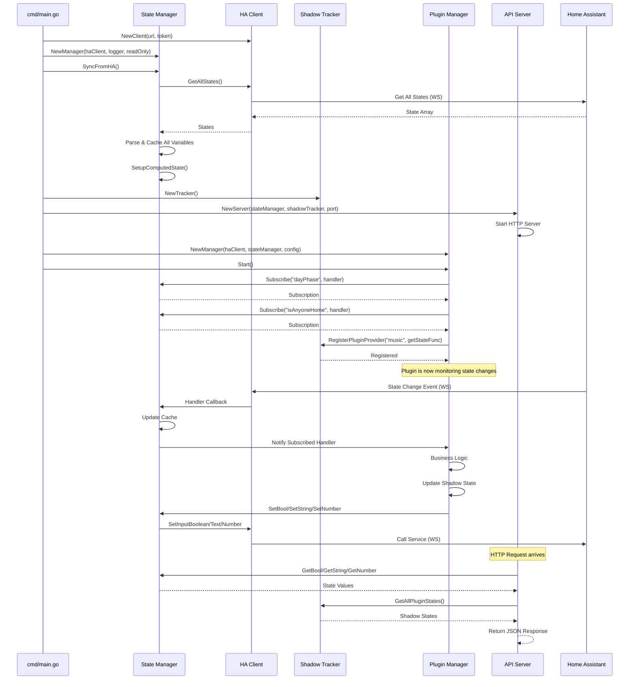

### Plugin Lifecycle

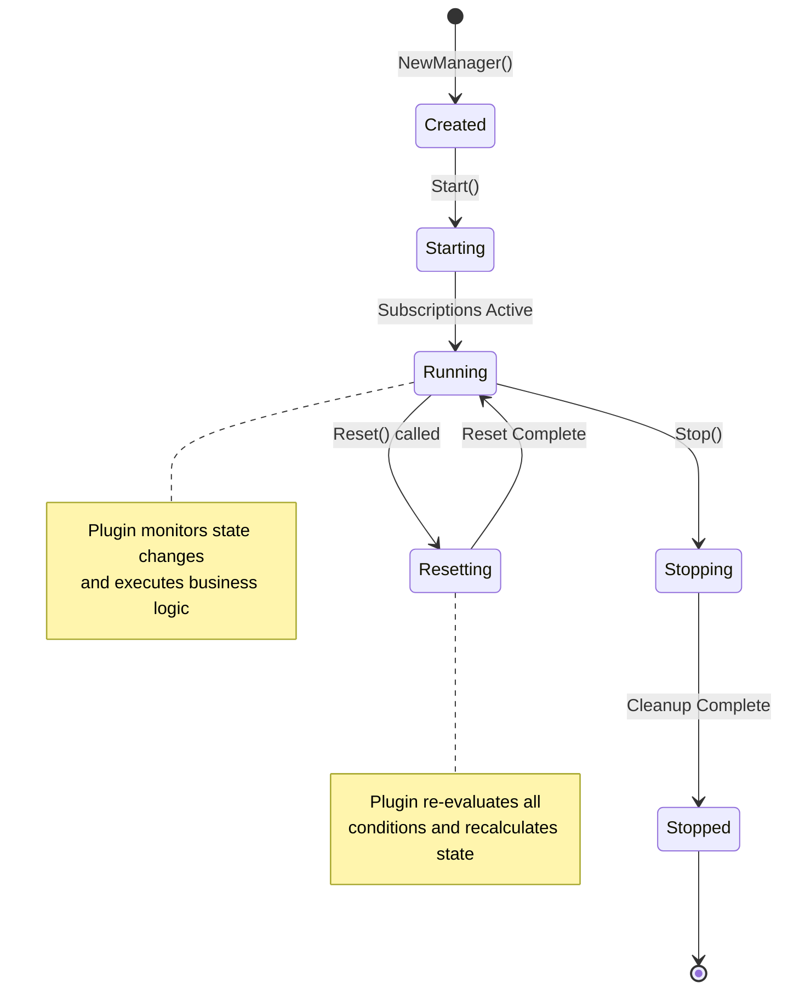

### Plugin Interfaces

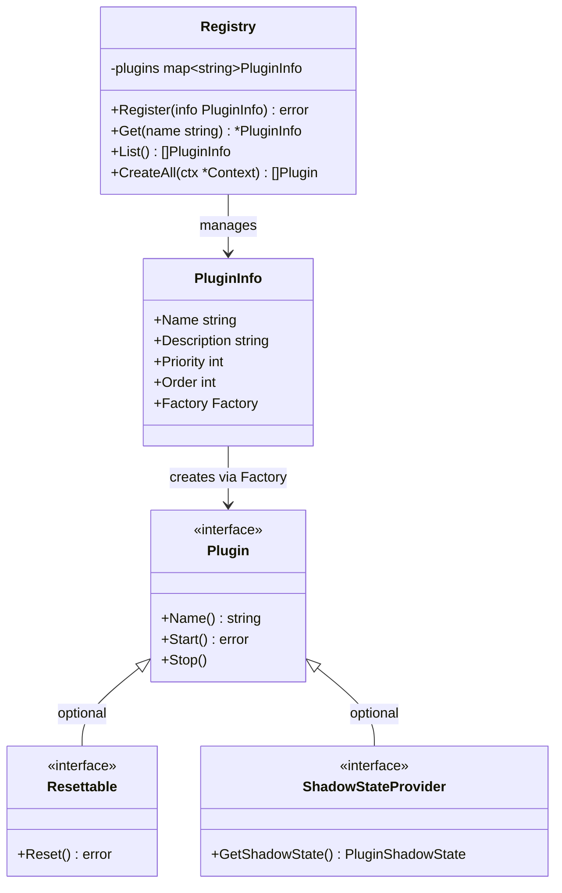

---

## State Synchronization Flow

How state changes propagate through the system.

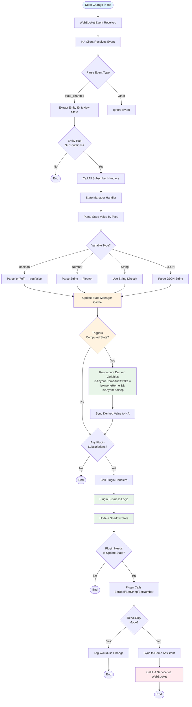

---

## Shadow State System

Shadow state captures the decision-making context for each plugin, enabling debugging and observability.

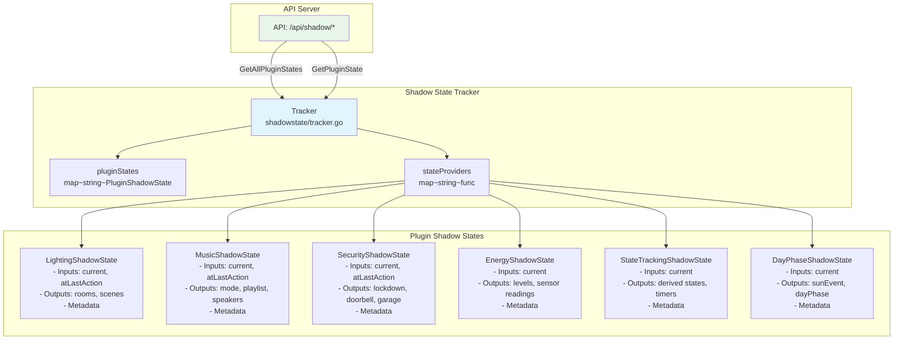

### Shadow State Interface

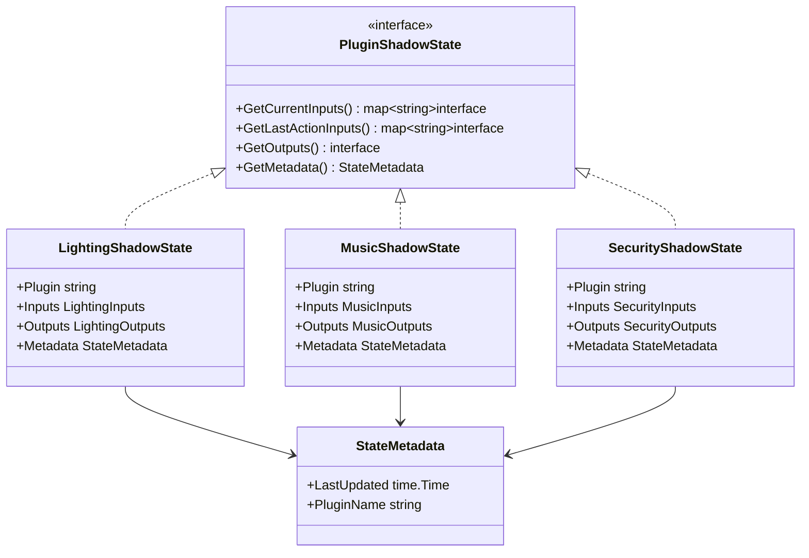

---

## API Server Endpoints

The HTTP API server provides observability into the system state.

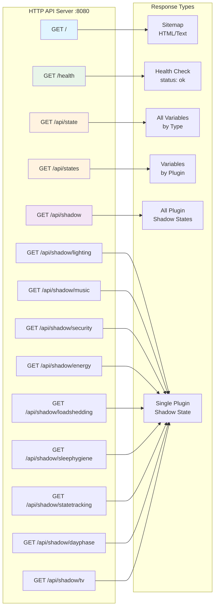

### API Response Structure

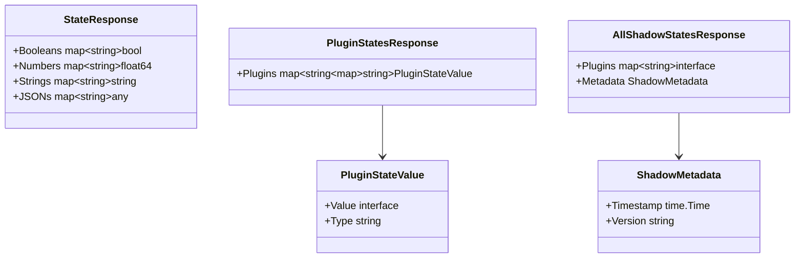

---

## Reset Coordinator Flow

The Reset Coordinator watches for the `reset` boolean and orchestrates system-wide resets.

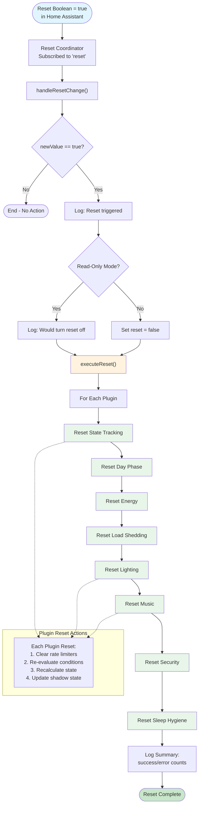

---

## Music Manager Logic Flow

Decision tree for music mode selection (matches Node-RED Music flow).

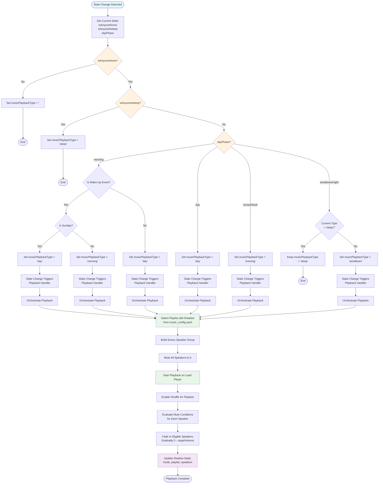

**Reference:** See `homeautomation-go/internal/plugins/music/manager.go` for implementation details.

---

## Lighting Control Logic Flow

Scene activation based on day phase and conditional logic (matches Node-RED Lighting Control flow).

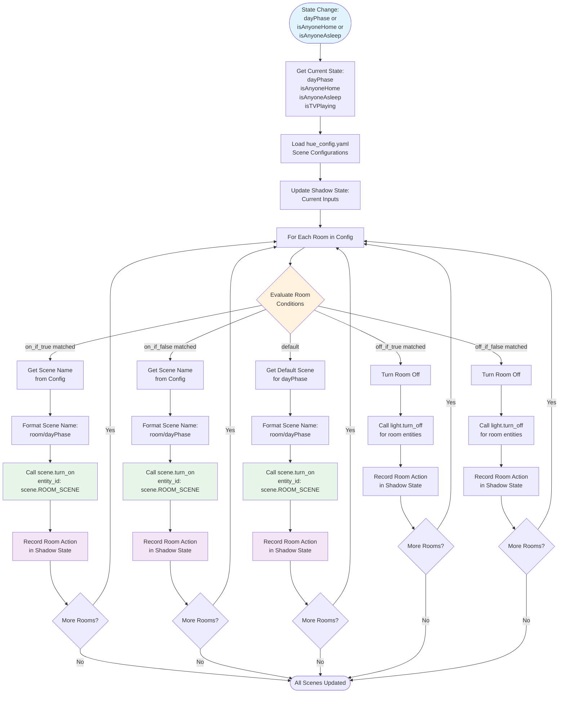

**Reference:** See `homeautomation-go/internal/plugins/lighting/manager.go` for implementation details.

**Condition Evaluation Logic:**
- `on_if_true`: Activate scene if ALL specified state variables are true
- `on_if_false`: Activate scene if ALL specified state variables are false
- `off_if_true`: Turn off room if ALL specified state variables are true
- `off_if_false`: Turn off room if ALL specified state variables are false
- Conditions are evaluated in order of precedence: off conditions → on conditions → default

---

## Energy State Logic Flow

Battery level calculation and energy state management (matches Node-RED Energy State flow).

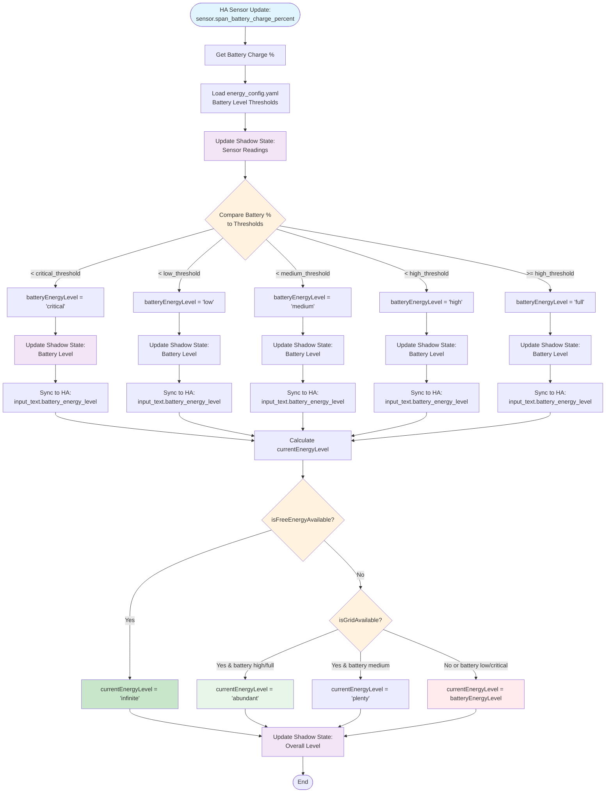

**Reference:** See `homeautomation-go/internal/plugins/energy/manager.go` for implementation details.

---

## State Variable Dependency Graph

Shows which plugins read/write which state variables (37 total: 26 booleans, 3 numbers, 6 strings, 2 local-only).

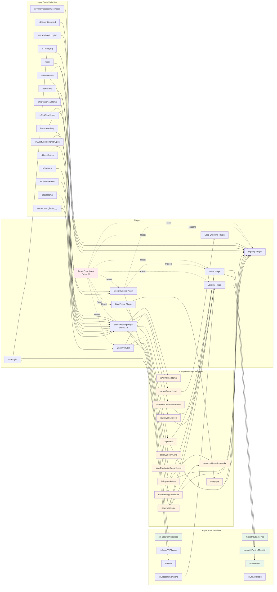

### State Variable Summary

| Category | Count | Examples |
|----------|-------|----------|
| **Boolean (input)** | 17 | isNickHome, isCarolineHome, isToriHere, isMasterAsleep, isGuestAsleep |
| **Boolean (computed)** | 5 | isAnyOwnerHome, isAnyoneHome, isAnyoneAsleep, isEveryoneAsleep, isAnyoneHomeAndAwake |
| **Boolean (output)** | 4 | isFadeOutInProgress, isLockdown, isAppleTVPlaying, isTVon |
| **Number** | 3 | alarmTime, remainingSolarGeneration, thisHourSolarGeneration |
| **String (computed)** | 5 | dayPhase, sunevent, batteryEnergyLevel, currentEnergyLevel, solarProductionEnergyLevel |
| **String (output)** | 2 | musicPlaybackType, currentlyPlayingMusicUri |
| **Local-only** | 2 | didOwnerJustReturnHome, currentlyPlayingMusic |

---

## How to Use These Diagrams

### Viewing in GitHub
All Mermaid diagrams render automatically in GitHub's markdown viewer.

### Viewing in VS Code
Install the "Markdown Preview Mermaid Support" extension for inline rendering.

### Updating Diagrams
When code changes significantly:
1. Update the relevant diagram(s) in this file
2. Ensure the diagram matches actual implementation
3. Reference file paths and line numbers when helpful
4. Update the "Last Updated" date in git commits

### Creating New Diagrams
Follow these conventions:
- Use consistent colors:
  - Light blue (`#e1f5ff`) for entry points
  - Light orange (`#fff3e0`) for decision/branching logic
  - Light green (`#e8f5e9`) for actions/outputs
  - Light purple (`#f3e5f5`) for shadow state / observability
  - Light red (`#ffebee`) for error/critical paths
- Include file references for traceability
- Keep diagrams focused on one concept/flow
- Link to implementation code with file paths

---

**Last Updated:** 2025-11-30
**Maintained By:** Development Team
**Related Documentation:**
- [IMPLEMENTATION_PLAN.md](./IMPLEMENTATION_PLAN.md) - Architecture and design decisions
- [GOLANG_DESIGN.md](./GOLANG_DESIGN.md) - Detailed flow descriptions
- [../migration/migration_mapping.md](../migration/migration_mapping.md) - State variable mapping
