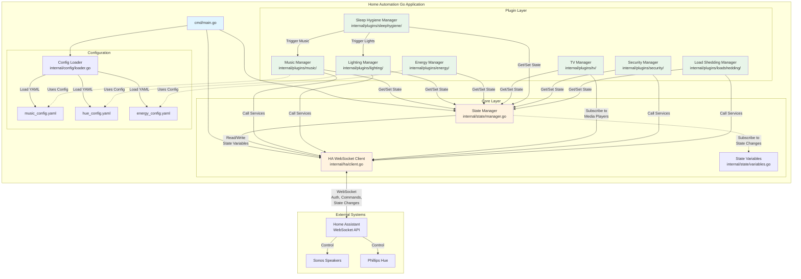
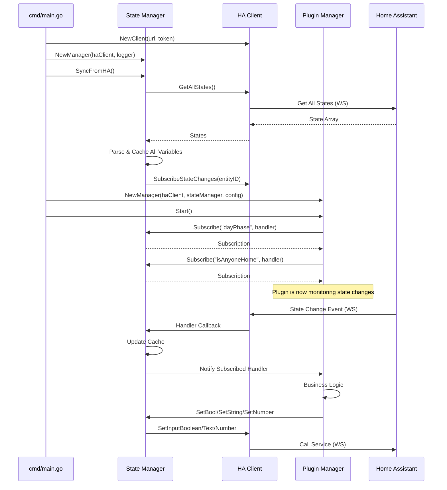
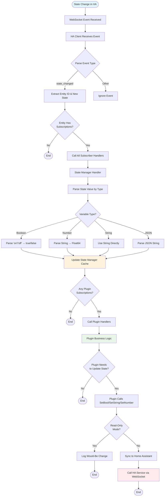
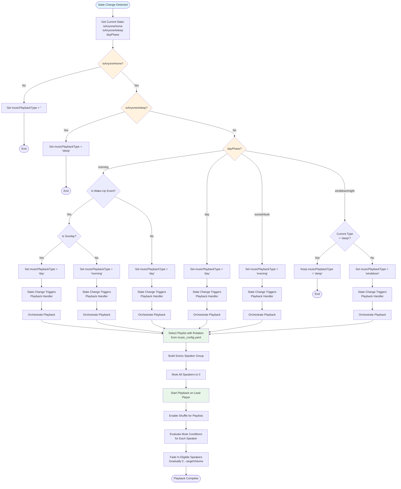
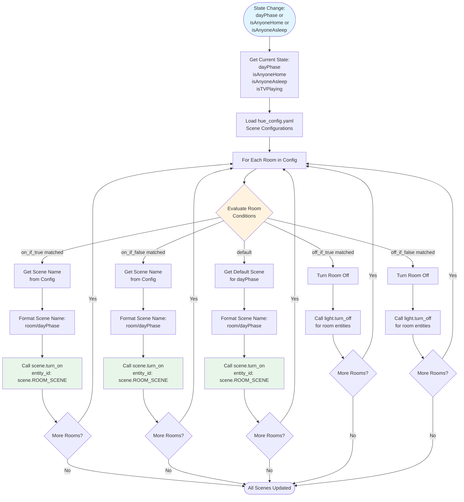
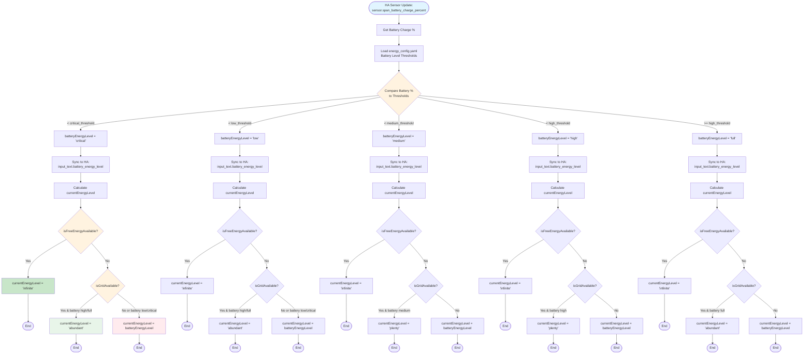
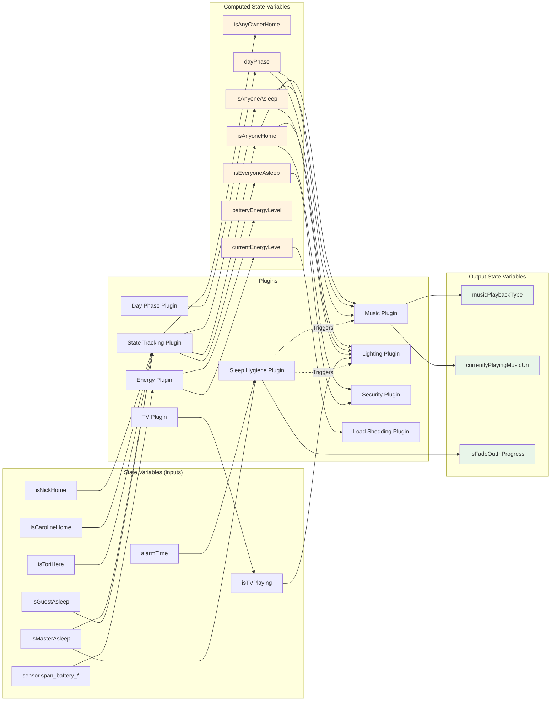

# Visual Architecture Guide

This document provides Mermaid diagrams to visualize the Golang home automation system architecture and logic flows.

## Table of Contents
- [System Architecture](#system-architecture)
- [Plugin System Architecture](#plugin-system-architecture)
- [State Synchronization Flow](#state-synchronization-flow)
- [Music Manager Logic Flow](#music-manager-logic-flow)
- [Lighting Control Logic Flow](#lighting-control-logic-flow)
- [Energy State Logic Flow](#energy-state-logic-flow)
- [State Variable Dependency Graph](#state-variable-dependency-graph)

---

## System Architecture

High-level view of the system components and their interactions.

---

## Plugin System Architecture

How plugins interact with the core state management system.

---

## State Synchronization Flow

How state changes propagate through the system.

---

## Music Manager Logic Flow

Decision tree for music mode selection (matches Node-RED Music flow).

**Reference:** See `homeautomation-go/internal/plugins/music/manager.go` for implementation details.

---

## Lighting Control Logic Flow

Scene activation based on day phase and conditional logic (matches Node-RED Lighting Control flow).

**Reference:** See `homeautomation-go/internal/plugins/lighting/manager.go` for implementation details.

**Condition Evaluation Logic:**
- `on_if_true`: Activate scene if ALL specified state variables are true
- `on_if_false`: Activate scene if ALL specified state variables are false
- `off_if_true`: Turn off room if ALL specified state variables are true
- `off_if_false`: Turn off room if ALL specified state variables are false
- Conditions are evaluated in order of precedence: off conditions → on conditions → default

---

## Energy State Logic Flow

Battery level calculation and energy state management (matches Node-RED Energy State flow).

**Reference:** See `homeautomation-go/internal/plugins/energy/manager.go` for implementation details.

---

## State Variable Dependency Graph

Shows which plugins read/write which state variables.

---

## How to Use These Diagrams

### Viewing in GitHub
All Mermaid diagrams render automatically in GitHub's markdown viewer.

### Viewing in VS Code
Install the "Markdown Preview Mermaid Support" extension for inline rendering.

### Updating Diagrams
When code changes significantly:
1. Update the relevant diagram(s) in this file
2. Ensure the diagram matches actual implementation
3. Reference file paths and line numbers when helpful
4. Update the "Last Updated" date in git commits

### Creating New Diagrams
Follow these conventions:
- Use consistent colors:
  - Light blue (`#e1f5ff`) for entry points
  - Light orange (`#fff3e0`) for decision/branching logic
  - Light green (`#e8f5e9`) for actions/outputs
  - Light red (`#ffebee`) for error/critical paths
- Include file references for traceability
- Keep diagrams focused on one concept/flow
- Link to implementation code with file paths

---

**Last Updated:** 2025-11-16
**Maintained By:** Development Team
**Related Documentation:**
- [IMPLEMENTATION_PLAN.md](./IMPLEMENTATION_PLAN.md) - Architecture and design decisions
- [GOLANG_DESIGN.md](./GOLANG_DESIGN.md) - Detailed flow descriptions
- [../migration/migration_mapping.md](../migration/migration_mapping.md) - State variable mapping
